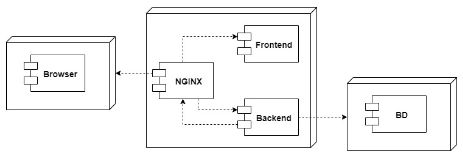
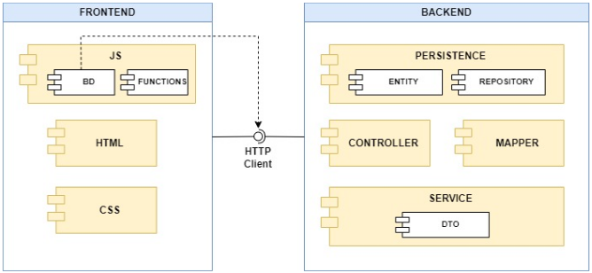
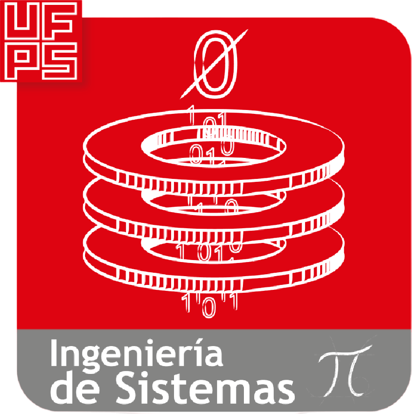

<div align="center">
<p>
  <h1>Solución Tecnológica que apoye el proceso de diálisis peritoneal en pacientes con Enfermedad Renal Crónica (ERC)</h1>
</p>
</div>
<div align="center">
  <p>
  <h1>Mi salud Renal</h1>
</p>
  
</div>

## Índice
1. 📋[Descripción](#descripcion)
2. 💻[Tecnologías](#tecnologías)
3. 🧩[Arquitectura](#arquitectura)
4. 🌐[Despliegue](#despliegue)
5. 🖥[Demo](#demo)
6. 👫[Autores](#autores)
7. 🏫[Institución Académica](#institución-académica)

### Descripción
___

Este repositorio contiene el código fuente de la solución tecnológica desarrollada que es presentada como proyecto de grado, el cual tiene como propósito el apoyo de pacientes con ERC. Para esto se cuenta con el código fuente de la aplicación frontend y un archivo war con la API REST del backend.

### Tecnologías
___

#### Tecnología de Frontend

El proyecto esta desarrolllado en la parte del frontend con Vanilla JS (HTML, CSS y JavaScript). Se uso ya que es la forma más pura y esencial de programación en el lado del cliente. A diferencia de las bibliotecas y frameworks, Vanilla JS aprovecha la potencia y flexibilidad del lenguaje de programación JavaScript en su estado más natural. Esto significa un código limpio, eficiente y altamente personalizable que permite construir aplicaciones robustas y rápidas.

  1. [](https://html.spec.whatwg.org/multipage/)
     - Usted puede encontrar documentación en: [Documentación](https://html.spec.whatwg.org/multipage/)  
     - Usted puede ver el siguiente marco conceptual y aprender sobre HTML: [Guia completa de HTML5](https://www.w3schools.com/html/default.asp)

  2. [](https://www.w3schools.com/css/default.asp)
     - Usted puede encontrar documentación en: [Documentación w3](https://www.w3.org/Style/CSS/) o [Documentación](https://developer.mozilla.org/es/docs/Web/CSS)
     - Usted puede ver el siguiente marco conceptual y aprender sobre CSS: [Guia completa de CSS](https://www.w3schools.com/css/default.asp)
    
  3. [](https://www.w3schools.com/js/default.asp)
     - Usted puede encontrar documentación en: [Documentación](https://developer.mozilla.org/es/docs/Web/JavaScript)
     - Usted puede ver el siguiente marco conceptual y aprender sobre JavaScript: [Guia completa de JS](https://www.w3schools.com/js/default.asp)
       
  4. [](https://www.w3schools.com/bootstrap/bootstrap_ver.asp)
     - Usted puede encontrar documentación en: [Documentación](https://developer.mozilla.org/es/docs/Web/JavaScript)
     - Usted puede ver el siguiente marco conceptual y aprender sobre Bootstrap: [Guia completa de BOOTSTRAP](https://www.w3schools.com/bootstrap/bootstrap_ver.asp)

#### Tecnología de Backend

El proyecto esta desarrolllado en la parte del frontend con Vanilla JS (HTML, CSS y JavaScript). Se uso ya que es la forma más pura y esencial de programación en el lado del cliente. A diferencia de las bibliotecas y frameworks, Vanilla JS aprovecha la potencia y flexibilidad del lenguaje de programación JavaScript en su estado más natural. Esto significa un código limpio, eficiente y altamente personalizable que permite construir aplicaciones robustas y rápidas.

  1. [![Java](https://img.shields.io/badge/Java-red?logo=data:image/svg%2bxml;base64,PHN2ZyB2aWV3Qm94PSIwIDAgMzg0IDUxMiIgeG1sbnM9Imh0dHA6Ly93d3cudzMub3JnLzIwMDAvc3ZnIiB4bWxuczp4bGluaz0iaHR0cDovL3d3dy53My5vcmcvMTk5OS94bGluayIgb3ZlcmZsb3c9ImhpZGRlbiI+PHBhdGggZD0iTTI3Ny43NCAzMTIuOUMyODcuNTQgMzA2LjIgMzAxLjE0IDMwMC40IDMwMS4xNCAzMDAuNCAzMDEuMTQgMzAwLjQgMjYyLjQ0IDMwNy40IDIyMy45NCAzMTAuNiAxNzYuODQgMzE0LjUgMTI2LjI0IDMxNS4zIDEwMC44NCAzMTEuOSA0MC43NCAzMDMuOSAxMzMuODQgMjgxLjggMTMzLjg0IDI4MS44IDEzMy44NCAyODEuOCA5Ny43NCAyNzkuNCA1My4yNCAzMDAuOCAwLjc0IDMyNi4yIDE4My4yNCAzMzcuOCAyNzcuNzQgMzEyLjlaTTE5Mi4zNCAyODAuOEMxNzMuMzQgMjM4LjEgMTA5LjI0IDIwMC42IDE5Mi4zNCAxMzUgMjk2IDUzLjIgMjQyLjg0IDAgMjQyLjg0IDAgMjY0LjM0IDg0LjUgMTY3LjI0IDExMC4xIDEzMi4xNCAxNjIuNiAxMDguMjQgMTk4LjUgMTQzLjg0IDIzNyAxOTIuMzQgMjgwLjhaTTMwNi45NCAxMDQuNkMzMDcuMDQgMTA0LjYgMTMxLjc0IDE0OC40IDIxNS40NCAyNDQuOCAyNDAuMTQgMjczLjIgMjA4Ljk0IDI5OC44IDIwOC45NCAyOTguOCAyMDguOTQgMjk4LjggMjcxLjY0IDI2Ni40IDI0Mi44NCAyMjUuOSAyMTUuOTQgMTg4LjEgMTk1LjM0IDE2OS4zIDMwNi45NCAxMDQuNlpNMzAwLjg0IDM3NS4xQzMwMC4yOTQgMzc2LjA1MyAyOTkuNjIxIDM3Ni45MjcgMjk4Ljg0IDM3Ny43IDQyNy4xNCAzNDQgMzc5Ljk0IDI1OC44IDMxOC42NCAyODAuNCAzMTUuMzI5IDI4MS42MTcgMzEyLjQ2OSAyODMuODE0IDMxMC40NCAyODYuNyAzMTQuMDIgMjg1LjQwNCAzMTcuNjk4IDI4NC40MDEgMzIxLjQ0IDI4My43IDM1Mi40NCAyNzcuMiAzOTYuOTQgMzI1LjIgMzAwLjg0IDM3NS4xWk0zNDggNDM3LjRDMzQ4IDQzNy40IDM2Mi41IDQ0OS4zIDMzMi4xIDQ1OC42IDI3NC4yIDQ3Ni4xIDkxLjMgNDgxLjQgNDAuNSA0NTkuMyAyMi4yIDQ1MS40IDU2LjUgNDQwLjMgNjcuMyA0MzggNzguNSA0MzUuNiA4NSA0MzYgODUgNDM2IDY0LjcgNDIxLjctNDYuMyA0NjQuMSAyOC42IDQ3Ni4yIDIzMi44NCA1MDkuNCA0MDEgNDYxLjMgMzQ4IDQzNy40Wk0xMjQuNDQgMzk2QzQ1Ljc0IDQxOCAxNzIuMzQgNDYzLjQgMjcyLjU0IDQyMC41IDI2Mi43NjggNDE2LjcwMyAyNTMuMzM0IDQxMi4wODcgMjQ0LjM0IDQwNi43IDE5OS42NCA0MTUuMiAxNzguOTQgNDE1LjggMTM4LjM0IDQxMS4yIDEwNC44NCA0MDcuNCAxMjQuNDQgMzk2IDEyNC40NCAzOTZaTTMwNC4yNCA0OTMuMkMyMjUuNTQgNTA4IDEyOC40NCA1MDYuMyA3MC45NCA0OTYuOCA3MC45NCA0OTYuNyA4Mi43NCA1MDYuNSAxNDMuMzQgNTEwLjQgMjM1LjU0IDUxNi4zIDM3Ny4xNCA1MDcuMSAzODAuNDQgNDYzLjUgMzgwLjQ0IDQ2My41IDM3NC4wNCA0ODAgMzA0LjI0IDQ5My4yWk0yNjAuNjQgMzUzQzIwMS40NCAzNjQuNCAxNjcuMTQgMzY0LjEgMTIzLjg0IDM1OS42IDkwLjM0IDM1Ni4xIDExMi4yNCAzMzkuOSAxMTIuMjQgMzM5LjkgMjUuNDQgMzY4LjcgMTYwLjQ0IDQwMS4zIDI4MS43NCAzNjUuOCAyNzMuOSAzNjMuMDMyIDI2Ni43MTcgMzU4LjY3NCAyNjAuNjQgMzUzWiIgZmlsbD0iI0ZGRkZGRiIvPjwvc3ZnPg==)](https://docs.oracle.com/en/java/ )
     - Usted puede encontrar documentación en: [Documentación](https://docs.oracle.com/en/java/ )  
     - Usted puede ver el siguiente marco conceptual y aprender sobre Java: [Guia completa de Java](https://www.w3schools.com/java/default.asp)

  2. [](https://spring.io/projects/spring-boot)
     - Usted puede encontrar documentación en: [Documentación](https://spring.io/projects/spring-boot)
    
  3. [![Maven](https://img.shields.io/badge/Java-red?logo=data:image/svg%2bxml;base64,PHN2ZyB3aWR0aD0iODAwIiBoZWlnaHQ9IjgwMCIgdmlld0JveD0iMCAwIDI0IDI0IiB4bWxucz0iaHR0cDovL3d3dy53My5vcmcvMjAwMC9zdmciIHhtbG5zOnhsaW5rPSJodHRwOi8vd3d3LnczLm9yZy8xOTk5L3hsaW5rIiBvdmVyZmxvdz0iaGlkZGVuIj48cGF0aCBkPSJNNC4yMzcgMC4wMDFDMy45MjUtMC4wMTIgMy41NzIgMC4wNzMgMy40MDkgMC40NTggMy4yNTEgMC44MzIgMy4xMjYgMS42NDYgMy4wNjkgMi43MzRMNC4yOTIgMy4zMjVDNC4yNzIgMi41ODggNC4yOTkgMS44OTUgNC4zNjggMS4yNTkgNC4zNDIgMS41NTggNC4zMTIgMi4yMTkgNC4zNzQgMy4yOTggNC4zOTMgMy42NCA0LjQyMyA0LjAyMyA0LjQ2MiA0LjQ0OCA0LjQ2NCA0LjQ3MiA0LjQ2NCA0LjQ5NSA0LjQ2OSA0LjUxNyA0LjU1MDQ5IDUuMzIzNjEgNC42NTM1MiA2LjEyNzkgNC43NzggNi45MjkgNC44MzUgNy4yOTcgNC45MDQgNy42ODEgNC45NzMgOC4wODlMNC45NjMgOC4wOTlDNC45NzcgOC4xMDkgNC45NzggOC4xMTcgNC45NzcgOC4xMjJMNS4wMDcgOC4yODJDNS4wMzcgOC40NDQgNS4wNjcgOC42MSA1LjEgOC43NzZMNS4yMDggOS4zMjkgNS4yNjQgOS42MThDNS40MDQ0OSAxMC4zMDk5IDUuNTU2ODUgMTAuOTk5MyA1LjcyMSAxMS42ODYgNS44MTEgMTIuMDY4IDUuOTA3IDEyLjQ2NiA2LjAwOCAxMi44NzIgNi4xMDYgMTMuMjU4IDYuMjA3IDEzLjY1NSA2LjMxNyAxNC4wNjUgNi40MTMgMTQuNDI3IDYuNTE2IDE0LjggNi42MiAxNS4xODIgNi42MjMgMTUuMiA2LjYzMiAxNS4yMTggNi42MzUgMTUuMjM3IDYuNzQ2NjYgMTUuNjMyNSA2Ljg2IDE2LjAyNzUgNi45NzUgMTYuNDIyTDcuMDI0IDE2LjU5NkM3LjEwMiAxNi44NTcgNy4xODIgMTcuMTI5IDcuMjY2IDE3LjQwMSA3LjE2NjY0IDE3LjM1OTggNy4wNjg5IDE3LjMxNDcgNi45NzMgMTcuMjY2TDYuNzgzIDE2LjYxMkM2Ljc2MyAxNi41MzUgNi43NDEgMTYuNDY0IDYuNzIxIDE2LjM4N0w2LjcxOSAxNi4zODMgNi43MTUgMTYuMzgxQzYuNjI4IDE2LjA4MSA2LjU0NSAxNS43NzQgNi40NTggMTUuNDY1IDYuNDM1IDE1LjM3OCA2LjQxNCAxNS4yOTIgNi4zODkgMTUuMjAyTDYuMDc1IDE0LjAyNEM1Ljk3NSAxMy42NDMgNS44ODEgMTMuMjU5IDUuNzg1IDEyLjg3IDUuNjkxIDEyLjQ4IDUuNiAxMi4wOSA1LjUwOCAxMS42OTggNS40MTUgMTEuMjk3IDUuMzI3IDEwLjg5OCA1LjI0MyAxMC40OTUgNS4xNTggMTAuMDk5IDUuMDgyIDkuNjk3IDUuMDAzIDkuMzAyIDQuOTI4MDYgOC45MTI4NCA0Ljg1NzcyIDguNTIyODIgNC43OTIgOC4xMzIgNC43ODggOC4xMTkgNC43ODYgOC4xMDIgNC43ODIgOC4wOTFMNC43ODYgOC4wODlDNC43MjkgNy43MDMgNC42NyA3LjMxOSA0LjYxMiA2LjkzOSA0LjU1NjY3IDYuNTM4MTkgNC41MDUzMyA2LjEzNjg0IDQuNDU4IDUuNzM1IDQuMzY1MzIgNC45MzQ1OCA0LjMwNzkzIDQuMTMwNDcgNC4yODYgMy4zMjVMMy4wNjYgMi43MzVDMy4wNjIgMi44MDkgMy4wNTYgMi44ODUgMy4wNTMgMi45NjUgMy4wNDEgMy4yNTkgMy4wMzMgMy41NyAzLjAzIDMuODk1IDMuMDI3MDcgNC4yODA2OCAzLjAyOTA3IDQuNjY2MzcgMy4wMzYgNS4wNTIgMy4wNDUgNS40MjIgMy4wNjEgNS44MDcgMy4wODEgNi4yIDMuMTAxIDYuNTM2IDMuMTIzIDYuODc1IDMuMTUxIDcuMjIyTDMuMTUzIDcuMjYxIDMuMTU5IDcuMjY1QzMuMTYyIDcuMjg4IDMuMTY2IDcuMzE1IDMuMTY1IDcuMzQxIDMuMTk4IDcuNzA5IDMuMjI5IDguMDggMy4yNzIgOC40NTYgMy4zNTA5MyA5LjE2NzMxIDMuNDUxOTggOS44NzU5OCAzLjU3NSAxMC41ODEgMy41ODUgMTAuNjQ1IDMuNTk5IDEwLjcxMiAzLjYxIDEwLjc3NiAzLjc1MjgzIDExLjU1ODEgMy45MzU0IDEyLjMzMjUgNC4xNTcgMTMuMDk2IDQuMjI3IDEzLjMzMyA0LjI5NyAxMy41NiA0LjM2NyAxMy43NzYgNC40MyAxMy45NTggNC40OTcgMTQuMTQxIDQuNTYxIDE0LjMyMSA0LjcxNiAxNC43NDMgNC44ODggMTUuMTUzIDUuMDczIDE1LjU1M0w1LjA3OSAxNS41NTdDNS4wODQyNCAxNS41NzQyIDUuMDkwOTMgMTUuNTkwOSA1LjA5OSAxNS42MDcgNS4zMjQgMTYuMDkyIDUuNTc0IDE2LjU1NyA1Ljg1NCAxNy4wMDIgNS44NjQgMTcuMDE1IDUuODc0IDE3LjAzNSA1Ljg4NCAxNy4wNDkgNS40MjkgMTYuODY2IDQuNjI1IDE2Ljk1MSA0LjYzMSAxNi45NTIgNS40NjEgMTcuMjQgNi4xODggMTcuNTkyIDYuNjQ3IDE4LjEyNyA2LjQ2NCAxOC4zMjcgNi4xMjQgMTguNDc5IDUuNjk0IDE4LjYwNCA2LjI4OCAxOC42NjggNi42MTggMTguNTY1IDYuNzM5IDE4LjUxMiA2LjQyOSAxOC43NzIgNi4yNTYgMTkuMjQ0IDYuMTA0IDE5Ljc1MiA2LjQ1NCAxOS4xODIgNi44IDE4LjgwMyA3LjEzNyAxOC42NTggNy4yMTUgMTguOTE2IDcuMjk5IDE5LjE4MiA3LjM4MSAxOS40NDYgNi42MTM2NSAyMC45NTEyIDUuODcyMiAyMi40Njk0IDUuMTU3IDI0IDUuMzQzNjggMjMuOTc0OSA1LjUwNTI2IDIzLjg1NzcgNS41ODcgMjMuNjg4IDUuNzE3IDIzLjQwNiA2LjQxNyAyMS45MTMgNy40OTUgMTkuODEzIDcuOTA4IDIxLjExNiA4LjM3NSAyMi40OTIgOC44ODEgMjMuOTIyIDguOTgzMzggMjMuNzg5OCA5LjAxMTk4IDIzLjYxNDkgOC45NTcgMjMuNDU3IDguNDk0NyAyMi4xNTA5IDguMDU4NjEgMjAuODM1NiA3LjY0OSAxOS41MTIgNy44MDMgMTkuMjEzIDcuOTY1IDE4LjkgOC4xMzMgMTguNTggOC4yNTggMTguNjIgOC4zODggMTguNjc0IDguNTIyIDE4LjczNSA4LjcyNSAxOC45MjEgOC44NzQgMTkuMjI2IDkuMDA0IDE5LjU3NSA5LjA0MDk3IDE5LjE3OTQgOC45MjEwMiAxOC43ODUgOC42NyAxOC40NzcgMTAuMDA1IDE4LjczNSAxMS4yMTcgMTguNTY3IDExLjk1NyAxNy42NjcgMTIuMDI0NSAxNy41ODM2IDEyLjA4ODUgMTcuNDk3NiAxMi4xNDkgMTcuNDA5IDExLjgyNCAxNy43MTMgMTEuNDY3IDE3LjgxMyAxMC44MzYgMTcuNjgyIDExLjgzMiAxNy40MDEgMTIuMzU5IDE3LjA2NSAxMi44NzEgMTYuNDYyIDEyLjk5MSAxNi4zMTcgMTMuMTE1IDE2LjE1OSAxMy4yNDIgMTUuOTgyIDEyLjI5OSAxNi43MDQgMTEuMzE1IDE2LjgwNCAxMC4zNDIgMTYuNDc1TDEwLjI5NyAxNi40NTdDMTEuMjExIDE2LjQ3NyAxMi41IDE1Ljk4MyAxMy4zODkgMTUuMjY4IDEzLjc5OSAxNC45MzggMTQuMTg1IDE0LjUzOCAxNC41NTkgMTQuMDU4IDE0LjgzOSAxMy42OTkgMTUuMTA5IDEzLjI5OCAxNS4zNzkgMTIuODQyIDE1LjYxMyAxMi40NDkgMTUuODQ3IDEyLjAxOCAxNi4wNzkgMTEuNTQ5IDE1LjgzOTUgMTEuNjI3NCAxNS41OTA3IDExLjY3MzUgMTUuMzM5IDExLjY4NkwxNS4xOTUgMTEuNjk0QzE1LjE0NyAxMS42OTYgMTUuMTAyIDExLjY5NCAxNS4wNDkgMTEuNjk2IDE1LjkzNCAxMS40OTggMTYuNTQ5IDEwLjk1NiAxNy4wNDMgMTAuMjQ5IDE2LjgwMyAxMC4zNjYgMTYuNDE1IDEwLjUxMSAxNS45NzMgMTAuNTQ2IDE1LjkxNSAxMC41NTIgMTUuODUzIDEwLjU1MiAxNS43OTEgMTAuNTUyIDE1Ljc3OCAxMC41NSAxNS43NjMgMTAuNTUyIDE1Ljc0NCAxMC41NSAxNi4wNSAxMC40NzIgMTYuMzE4IDEwLjM3MiAxNi41NTQgMTAuMjQxIDE2LjY3ODIgMTAuMTcgMTYuNzk3OCAxMC4wOTEyIDE2LjkxMiAxMC4wMDUgMTYuOTU2IDkuOTY4IDE3IDkuOTM1IDE3LjA0MiA5Ljg5OSAxNy4xNDEgOS44MTMgMTcuMjM1IDkuNzE5IDE3LjMyMiA5LjYxMiAxNy4zNSA5LjU3OCAxNy4zNzggOS41NDkgMTcuNDAyIDkuNTE0IDE3LjQzOCA5LjQ2NCAxNy40NzUgOS40MTYgMTcuNTA2IDkuMzY4IDE3LjY5MTkgOS4xMDIwOSAxNy44NjIyIDguODI1NjMgMTguMDE2IDguNTQgMTguMDMxIDguNTA5IDE4LjA0OCA4LjQ4MyAxOC4wNjIgOC40NTIgMTguMTAyIDguMzY4IDE4LjE0MiA4LjI5MiAxOC4xNzIgOC4yMjUgMTguMjE0IDguMTI2IDE4LjI0NiA4LjA0NiAxOC4yNjQgNy45ODcgMTguMjMwMSA4LjAwODEzIDE4LjE5MzkgOC4wMjUyNSAxOC4xNTYgOC4wMzggMTcuODgzIDguMTUgMTcuNDI5IDguMjI1IDE3LjA3IDguMjM5IDE3LjA2NiA4LjIzOSAxNy4wNjIgOC4yMzkgMTcuMDU3IDguMjQzTDE2Ljk5IDguMjQzQzE3LjcxIDguMDI5IDE4LjA1NyA3Ljc5MyAxOC40MTIgNy40MjUgMTguODI3OCA2Ljk3NDk5IDE5LjIxMzMgNi40OTc5NCAxOS41NjYgNS45OTcgMTkuODMgNS42MjcgMjAuMDcxIDUuMjU5IDIwLjI1OCA0LjkyNSAyMC4zNjczIDQuNzMyODYgMjAuNDY2OCA0LjUzNTI3IDIwLjU1NiA0LjMzMyAyMC42MjIgNC4xNzYgMjAuNjc4IDQuMDI4IDIwLjcyOCAzLjg4MyAyMC4yNjIgMy44OTMgMTkuNzQyIDMuODk0IDE5LjI0OCAzLjg4MyAxOS43NDMgMy44OTMgMjAuMjYzIDMuODkgMjAuNzMyIDMuODc4IDIxLjIzMiAyLjM5MyAyMC43OTUgMS42MTYgMjAuNzk1IDEuNjE2IDIwLjc5NSAxLjYxNiAyMC4yNjkgMC40MDQgMTkuMzk1IDAuNzY1IDE4Ljk2OSAwLjk0IDE4LjIyMyAxLjQ5NSAxNy4zMTIgMi4zMjVMMTcuODI2IDMuNzc1QzE4LjM1NzQgMy4yMDM3NiAxOC45MjY0IDIuNjY4NTggMTkuNTI5IDIuMTczIDE5LjI3MiAyLjM5MyAxOC43MjIgMi44OTkgMTcuOTE0IDMuODE3IDE3LjY1OCA0LjEwNyAxNy4zNzcgNC40NDEgMTcuMDcgNC44MTQgMTcuMDUzIDQuODM0IDE3LjAzNSA0Ljg1MiAxNy4wMjMgNC44NzQgMTYuNDQ4MyA1LjU4ODAzIDE1Ljg5MjcgNi4zMTcyOSAxNS4zNTcgNy4wNjEgMTUuMTA5IDcuNDAxIDE0Ljg1OSA3Ljc2NSAxNC41OTIgOC4xNDlMMTQuNTc2IDguMTQ5QzE0LjU3OCA4LjE2OSAxNC41NzIgOC4xNzcgMTQuNTY2IDguMTgxTDE0LjQ2NSA4LjMzM0MxNC4zNjEgOC40ODggMTQuMjUyIDguNjQzIDE0LjE0NyA4LjgwM0wxMy43OTUgOS4zMzdDMTMuNzM0IDkuNDI3IDEzLjY3MSA5LjUxOCAxMy42MDkgOS42MTQgMTMuNDI1IDkuODk2IDEzLjI0MiAxMC4xODcgMTMuMDUxIDEwLjQ4NyAxMi41NjQxIDExLjI1OTYgMTIuMDg4IDEyLjAzOSAxMS42MjMgMTIuODI1IDExLjE2NTEgMTMuNTk5NyAxMC43MTgxIDE0LjM4MDggMTAuMjgyIDE1LjE2OCAxMC4yNyAxNS4xODUgMTAuMjYyIDE1LjIwOCAxMC4yNDggMTUuMjI1IDEwLjAyMzkgMTUuNjMxOSA5LjgwMTIzIDE2LjAzOTUgOS41OCAxNi40NDhMOS40ODMgMTYuNjI5QzkuMzEzIDE2Ljk0NyA5LjEzNyAxNy4yNzEgOC45NjMgMTcuNjA4IDguOTYzIDE3LjYxMiA4Ljk1OCAxNy42MTYgOC45NTcgMTcuNjIxIDguOTMxIDE3LjY2OSA4LjkwNyAxNy43MTQgOC44ODUgMTcuNzYyIDguNzY4IDE3Ljk4NCA4LjY2NyAxOC4xODYgOC40MzUgMTguNjMyIDguMzY0MjIgMTguNTYzIDguMjg2MDkgMTguNTAyIDguMjAyIDE4LjQ1TDguNTQ3IDE3LjhDOC41OTQgMTcuNzExIDguNjQzIDE3LjYyMyA4LjY5IDE3LjUzTDguNzMgMTcuNDUzIDkuMjc2IDE2LjQ1MiA5LjQwNiAxNi4yMTkgOS40MDYgMTYuMjEzIDkuNDA1IDE2LjIwN0M5LjU3NCAxNS44OTcgOS43NSAxNS41ODcgOS45MjUgMTUuMjY3IDkuOTc2IDE1LjE4IDEwLjAyNyAxNS4wOTQgMTAuMDc4IDE1LjAwMiAxMC4zMDIgMTQuNjA3IDEwLjUzMiAxNC4yMDggMTAuNzYyIDEzLjgwNSAxMS40NDc0IDEyLjYyMTIgMTIuMTU5MyAxMS40NTI5IDEyLjg5NyAxMC4zMDEgMTMuMTQ0IDkuOTE1IDEzLjQgOS41MzEgMTMuNjUxIDkuMTQ5IDEzLjc0MyA5LjAxMSAxMy44MzMgOC44NzcgMTMuOTMgOC43MzkgMTQuMDg4NiA4LjUwNDQgMTQuMjQ4NiA4LjI3MDczIDE0LjQxIDguMDM4IDE0LjQxNyA4LjAyNiAxNC40MjkgOC4wMTQgMTQuNDM2IDguMDAxTDE0LjQ0MiA4LjAwMUMxNC43MDIgNy42NDUgMTQuOTU5IDcuMjg4IDE1LjIxNSA2LjkzNiAxNS40OTMgNi41NjMgMTUuNzY5IDYuMjAxIDE2LjA0NSA1Ljg0NiAxNi42MDY2IDUuMTI4NjIgMTcuMTk5NSA0LjQzNjI4IDE3LjgyMiAzLjc3MUwxNy4zMDcgMi4zMjVDMTcuMjQ3IDIuMzgyIDE3LjE4MSAyLjQ0MSAxNy4xMTUgMi41MDMgMTYuODU4NCAyLjc0MTg4IDE2LjYwNTcgMi45ODQ5MSAxNi4zNTcgMy4yMzIgMTYuMDYyIDMuNTI2IDE1Ljc2IDMuODM4IDE1LjQ0NSA0LjE2NyAxNC44ODQ3IDQuNzY1MDMgMTQuMzQwNSA1LjM3NzkyIDEzLjgxMyA2LjAwNUwxMy43ODMgNi4wMzggMTMuNzg1IDYuMDQ2QzEzLjc2OCA2LjA2NiAxMy43NTIgNi4wOSAxMy43MzEgNi4xMSAxMy40NjUgNi40MzMgMTMuMTkzIDYuNzU5IDEyLjkzIDcuMDk1IDEyLjQyODMgNy43Mjk4OSAxMS45NDY0IDguMzgwMjEgMTEuNDg1IDkuMDQ1IDExLjQ0MiA5LjEwNSAxMS40IDkuMTcxIDExLjM1OCA5LjIzMSAxMC44NTE1IDkuOTc0MzIgMTAuMzgzMiAxMC43NDMgOS45NTUgMTEuNTM0IDkuODI1IDExLjc4MSA5LjY5OSAxMi4wMTkgOS41ODUgMTIuMjQ5IDkuNDg5IDEyLjQ0NCA5LjM5OCAxMi42NDQgOS4zMDcgMTIuODQgOS4wOTcgMTMuMzAzIDguOTA5IDEzLjc3IDguNzQxIDE0LjIzOUw4Ljc0MyAxNC4yNDVDOC43MzI2NCAxNC4yNjM1IDguNzIzOTQgMTQuMjgyOSA4LjcxNyAxNC4zMDMgOC42MDkgMTQuNjA2IDguNTE0IDE0LjkxMSA4LjQyNyAxNS4yMTcgOC4yODcgMTUuMzkxIDguMTI1IDE1LjU0MiA3Ljk0NCAxNS42NzcgNy45MDE4MSAxNS42MjQ4IDcuODU4MTIgMTUuNTczNyA3LjgxMyAxNS41MjQgOC4yNTUxNCAxNC44NjA3IDguNTM3MjIgMTQuMTAzOSA4LjYzNyAxMy4zMTMgOC42ODk1NCAxMi44MTgxIDguNjg0MTcgMTIuMzE4NyA4LjYyMSAxMS44MjUgOC41NzUgMTEuNDI1IDguNDk1IDExLjAwNSA4LjM4MyAxMC41NTEgOC4yODYgMTAuMTU4IDguMTY2IDkuNzQxIDguMDIgOS4zMDMgNy45MjkgOS40ODggNy44IDkuNjcgNy42NDEgOS44NDhMNy41NTUgOS45NDJDNy41MjYgOS45NzQgNy40OTUgMTAuMDAyIDcuNDYzIDEwLjAzNiA3Ljg5NyA5LjM2MiA3Ljk0OSA4LjYzOSA3LjgyMSA3Ljg4OCA3LjcxMDUgOC4xOTg2NyA3LjU0NDQ3IDguNDg2NjggNy4zMzEgOC43MzggNy4yOTggOC43NzYgNy4yNTkgOC44MTUgNy4yMjEgOC44NTQgNy4yMTEgOC44NjEgNy4yMDIgOC44NzIgNy4xODggOC44ODIgNy4zMzIgOC42NDIgNy40MzggOC40MTUgNy41MDYgOC4xODQgNy41MjIxOCA4LjEzNjE2IDcuNTM1NTQgOC4wODc0MSA3LjU0NiA4LjAzOCA3LjU2MTY3IDcuOTYzNTQgNy41NzQzNCA3Ljg4ODQ4IDcuNTg0IDcuODEzTDcuNjAyIDcuNjY3QzcuNjExMjUgNy41NDkxNSA3LjYxMDU4IDcuNDMwNzQgNy42IDcuMzEzIDcuNTk3IDcuMjczIDcuNTk2IDcuMjM3IDcuNTkgNy4yIDcuNTggNy4xNDUgNy41NzQgNy4wOTUgNy41NjMgNy4wNDYgNy41MTUwMSA2Ljc2MjUgNy40NTA1NiA2LjQ4MjAyIDcuMzcgNi4yMDYgNy4zNiA2LjE3OCA3LjM1NSA2LjE1IDcuMzQ0IDYuMTIyIDcuMzE3IDYuMDQzIDcuMjk2IDUuOTczIDcuMjcyIDUuOTEzIDcuMjQ1OCA1Ljg0MTc2IDcuMjE1NzUgNS43NzE5OSA3LjE4MiA1LjcwNCA3LjE3NDI3IDUuNzM4NTggNy4xNjI1MiA1Ljc3MjE0IDcuMTQ3IDUuODA0IDcuMDQ1IDYuMDQ0IDYuODA3IDYuMzc0IDYuNTkgNi42MDQgNi41ODcgNi42MDcgNi41ODMgNi42MDkgNi41ODMgNi42MTRMNi41NDMgNi42NTdDNi44NjEgNi4wNzcgNi45MzMgNS43MTEgNi45MjggNS4yNTkgNi45MTAzNSA0LjcxNzczIDYuODU2OSA0LjE3ODIxIDYuNzY4IDMuNjQ0IDYuNzEwMTcgMy4yNzIxNyA2LjYzMjczIDIuOTAzNjYgNi41MzYgMi41NCA2LjQ4NTM2IDIuMzUxMTEgNi40MjUyOCAyLjE2NDg4IDYuMzU2IDEuOTgyIDYuMzAzMDggMS44NDk3NyA2LjI0NTcxIDEuNzE5MzYgNi4xODQgMS41OTEgNi4xODQ2NyAxLjU4OTY3IDYuMTg1MzMgMS41ODgzMyA2LjE4NiAxLjU4NyA1LjU3NiAwLjM0MSA0LjgyIDAuMTI0IDQuODIgMC4xMjQgNC44MiAwLjEyNCA0LjU1IDAuMDE0IDQuMjM4IDAuMDAxWk03LjYxNyAxNS43ODQgNy42NDkgMTUuODY2IDcuNjQ5IDE1Ljg2OEM3LjU4OSAxNS45MDEgNy41MzMgMTUuOTM1IDcuNDcxIDE1Ljk2NSA3LjQ1OSAxNS45NjkgNy40NDcgMTUuOTc3IDcuNDMyIDE1Ljk4MyA3LjQ5NzczIDE1LjkxOTkgNy41NTk4MyAxNS44NTMxIDcuNjE4IDE1Ljc4M1pNNy4wMTQgMTcuNDFDNy4xNDQgMTcuNTQ2IDcuMjY0IDE3LjY1MiA3LjM2OCAxNy43M0w3LjQzOCAxNy45NTdDNy4zNTQ5IDE3Ljk2OTEgNy4yNzI3MSAxNy45ODY4IDcuMTkyIDE4LjAxTDcuMTYyIDE3LjkxMkM3LjEzOCAxNy44MjggNy4xMTQgMTcuNzQyIDcuMDg2IDE3LjY1NUw3LjA2NSAxNy41ODJaTTcuMjc0IDE4LjI4NUM3LjM2NDQ1IDE4LjI4MzEgNy40NTQ5NCAxOC4yODY0IDcuNTQ1IDE4LjI5NUw3LjYxNSAxOC41MjRDNy42OTY1OSAxOC41MDk1IDcuNzc5OTggMTguNTA4MiA3Ljg2MiAxOC41Mkw3LjUzNiAxOS4xNDdDNy40NDc2NSAxOC44NiA3LjM2MDMyIDE4LjU3MjYgNy4yNzQgMTguMjg1WiIgZmlsbD0iI0ZGRkZGRiIvPjwvc3ZnPg==)](https://maven.apache.org/)
     - Usted puede encontrar documentación en: [Documentación](https://maven.apache.org/)

#### Tecnología de despliegue

   1. [](https://www.docker.com/)
     - Usted puede encontrar documentación en: [Documentación](https://docs.docker.com/)
     - Usted puede instalar Docker Desktop: [Docker Desktop](https://www.docker.com/products/docker-desktop/)

### Arquitectura
___

La solución tecnológica Mi Salud Renal tiene como objetivo principal disminuir la brecha de comunicación que hay entre los médicos y sus pacientes al momento de realizar la consulta médica. Además, se busca asegurar que los pacientes tengan un mayor control sobre su tratamiento, ya que actualmente resulta agotador y obsoleto llevar un registro de su análisis de tratamiento en un cuadernillo de papel. Para abordar este problema, se ha desarrollado un sistema basado en una arquitectura distribuida que consta de dos aplicaciones, una en el backend y otra en el frontend. Estas aplicaciones permiten a los usuarios llevar a cabo todas las operaciones necesarias para que los médicos puedan seguir de manera detallada el progreso del tratamiento de sus pacientes.

La aplicación está basada en una arquitectura distribuida, que está conformada principalmente por dos capas independientes, llamadas backend y frontend.

Para  la comunicación fluida entre el frontend y el backend, se implementaron peticiones Fetch desde el código frontend, específicamente en las funciones alojadas en los archivos JavaScript ubicados en la carpeta 'bd'. Estas peticiones se encargan de transmitir las solicitudes entre las dos aplicaciones. En el proceso, los Controllers, son los responsables de gestionar la lógica de negocio y manipular la interacción con la base de datos, reciben y procesan estas peticiones, generando respuestas coherentes que permiten una integración eficiente entre los componentes frontend y backend del sistema. Este enfoque garantiza un intercambio de información eficaz, facilitando así el desarrollo de la aplicación de forma dinámica y coordinada.

Ya que esta arquitectura tiene un enfoque de diseño que se utiliza para crear sistemas de software en los que los componentes o módulos del sistema se ejecutan en múltiples nodos de una red.



##### Vista de implementación
La vista de implementación en arquitectura de software representa cómo las partes reutilizables del sistema se organizan físicamente en unidades intercambiables conocidas como componentes. Esta vista proporciona una representación detallada de cómo se traduce el diseño de software, que incluye clases y otros elementos, en componentes reales. Además, muestra las interfaces y las relaciones de dependencia entre estos componentes. En esencia, los componentes son las piezas de alto nivel reutilizables que sirven como bloques de construcción fundamentales para ensamblar sistemas de software.



### Despliegue
___

#### Docker Compose

El docker compose lo puede encontrar [aqui](https://github.com/leideryesidmm/DialisisPeritonealDeploy/blob/main/docker-compose.yml).

El docker compose cuenta con dos servicios que se desplegan correspondiente al frontend y el backend de la aplicación.

El servicio frontend: el contenedor del frontend se llama misaludrenal_frontend y cuenta con una imagen de nginx:1.17.1-alpine.
```
 frontend:
    container_name: misaludrenal_frontend
    image: nginx:1.17.1-alpine
    working_dir: /usr/local/app
    volumes:
      - type: bind
        source: /var2/dockers-studentsprojects-deploy-0/DialisisPeritonealDeploy/my-nginx-frontend.conf
        target: /etc/nginx/conf.d/default.conf
      - type: bind
        source: /var2/dockers-studentsprojects-deploy-0/DialisisPeritonealDeploy/frontend/
        target: /usr/share/nginx/html
    ports:
      - 8103:80
```
El service backend: el contenedor del backend se llama misaludrenal_backend y cuenta con una imagen de openjdk:19.

```
backend:
    container_name: misaludrenal_backend
    image: openjdk:19
    working_dir: /code
    ports:
      - 8104:8081
    environment:
      - DATABASE_URL=*******************************************************
      - DATABASE_USERNAME=*******
      - DATABASE_PASSWORD=*********************
    volumes:
      - type: bind  
        source: /var2/dockers-studentsprojects-deploy-0/DialisisPeritonealDeploy/backend/target
        target: /code
    command: java -jar /code/DialisisPeritoneal-0.0.1-SNAPSHOT.war
```

#### Variables de entorno
|Variable|Descripción|Valor por defecto|
|:-------:|:-------:|:-------:|
|DATABASE_URL|es la dirección con la cual se puede acceder a la base de datos.|jdbc:mysql://10.128.0.15:3306/db01student1151788?useSSL=false&serverTimezone=UTC|
|DATABASE_USERNAME|Usuario para conectarse a la base de datos|X|
|DATABASE_PASSWORD|Contraseña para conectarse a la basede datos|X|


#### ¿Como desplegar?

Para el despliegue de la aplicación se usa docker, para ello se debe seguir los siguientes pasos:

- Hacer "Fork" el proyecto y descargar o clonar el repositorio
- Instalación de docker: [Docker](https://www.docker.com/)
- Configurar el docker compose para la conexión con la base de datos (host, usuario y contraseña).
- Abrir terminal en la ubicación de la carpeta generada al descargar el proyecto
- Escribir el siguiente comando para correr el docker-compose "docker-compose up --build"
- Verificar en el docker que se esten ejecutando el frontend y backend correctamente 


### Demo
___

Esta solución se implementó en un servidor suministrado por la universidad con el propósito de llevar a cabo pruebas por parte del equipo de desarrollo y un piloto de prueba en la unidad renal Davita. Durante este proceso, se evaluó su desempeño con usuarios que eran pacientes sometidos a diálisis peritoneal en dicha unidad renal.

En el siguiente enlace podra encontrar la aplicación funcional: [Mi Salud Renal]

### Autores
___

#### Proyecto desarrollado por:

- [Jheyner Alexander Lobo] (<jheyneralexanderld@ufps.edu.co>).
- [Leider Yesid Martinez] (<leideryesidmm@ufps.edu.co>).
- [Matilde Alexandra Arévalo] (<matildealexandraal@ufps.edu.co>).

#### Directores:
Director: Ingeniero de Sistemas. Mgc. en Ingeniería e Ingeniería de Sistemas y computación
- [Milton Jesús Vera ](<miltonjesusvc@ufps.edu.co>)
  
Co-directora: Enfermera, Mgc. en Enfermería
- [Sandra Milena Martínez](<sandramilenamr@ufps.edu.co>)


### Institución Académica
___

Proyecto desarrollado como Proyecto de grado del  [Programa de Ingeniería de Sistemas] de la [Universidad Francisco de Paula Santander]
<div class="row" style="text-align:center;">
  <a href="https://ww2.ufps.edu.co/"></a>
  <a href="https://ingsistemas.cloud.ufps.edu.co/"></a>
</div>


  [Programa de Ingeniería de Sistemas]:<https://ingsistemas.cloud.ufps.edu.co/>
  [Universidad Francisco de Paula Santander]:<https://ww2.ufps.edu.co/>
  [Mi Salud Renal]:<https://studentsprojects.cloud.ufps.edu.co/misaludrenalpruebas/>
